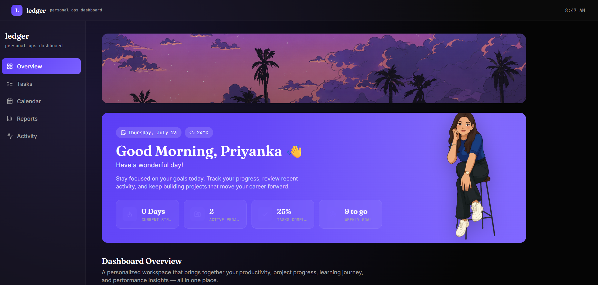

# 🚀 Priyanka's Dashboard

A sleek, lightweight personal productivity dashboard built to streamline your daily workflow. Track tasks, view productivity metrics, and log daily activities from a single, centralized interface.

 

---

## ✨ Features

- **📝 Smart Task Management:** Create, organize, and prioritize your daily to-do lists.
- **📊 Activity Tracking:** Log your routines and track progress over time.
- **📈 Visual Reports:** Stay motivated with clear, breakdown views of your productivity.
- **🔒 Privacy-Focused:** Your data never leaves your machine. Everything is saved locally.

---

## 🛠️ Built With

- **Vite** — Ultra-fast frontend build tooling
- **Vanilla JavaScript** — Pure, lightning-fast interactive logic
- **Tailwind CSS** — Modern, utility-first styling framework
- **PostCSS** — Tool for transforming styles with JS plugins

---

## 🚀 Getting Started

Follow these steps to get a local copy of the project running on your machine.

### Prerequisites

Make sure you have **Node.js** installed on your system. You can download it from [nodejs.org](https://nodejs.org).

### Installation

1. **Clone the repository:**
   ```bash
   git clone https://github.com
   cd your-repo-name
   ```

2. **Install project dependencies:**
   ```bash
   npm install
   ```

3. **Start the local development server:**
   ```bash
   npm run dev
   ```

4. **Open the app:**
   Navigate to the local URL printed in your terminal (usually `http://localhost:5173`).

---

## 📦 Project Structure

```text
├── .github/workflows/   # Automated deployment configurations
│   └── deploy.yml       # GitHub Actions workflow file
├── public/              # Static assets (images, icons, etc.)
│   └── .nojekyll        # Disables Jekyll processing on GitHub Pages
├── src/                 # Application source files (JS and CSS logic)
├── index.html           # Main entry point document
├── package.json         # Manifest file with scripts and dependencies
├── postcss.config.js    # PostCSS configuration for Tailwind
├── tailwind.config.js   # Custom Tailwind design utility settings
└── vite.config.js       # Vite bundler configurations
```

---

## 🚀 Deployment

This repository is configured with **GitHub Actions** for continuous delivery. 

* **Automated Builds:** Every time you push updates directly to the `main` branch, the `deploy.yml` workflow automatically triggers.
* **Hosting:** The action builds your project and publishes the final artifact directly to **GitHub Pages**.
* **Manual Builds:** If you need to check the production build locally before pushing, run:
  ```bash
  npm run build
  ```

---

## 💾 Data & Privacy

This application uses the browser's native `localStorage` API to save your dashboard information. 
* **No databases** or external backend servers are utilized.
* Data persists across sessions as long as you use the same device and browser.
* *Warning:* Clearing your browser history, cache, or cookies for this site will reset your dashboard data.
*
